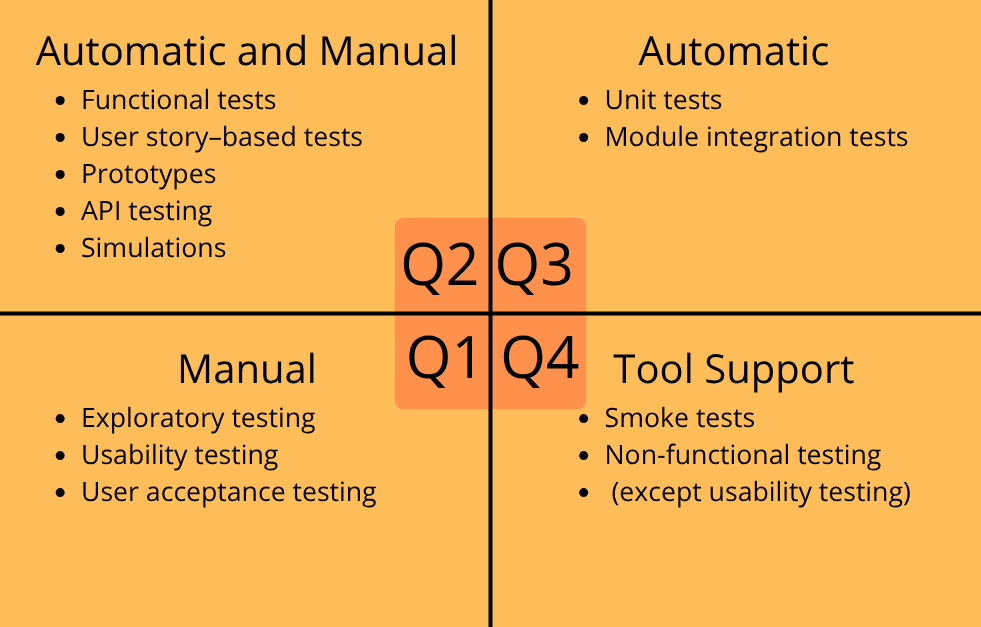

# QM, QA i QC 

**QM (Quality Management)** - a quality management system within an organization that includes quality policy, quality objectives, processes, supervision, and continuous improvement in order to ensure that products or services comply with customer requirements and standards. It includes QA and QC.

**QA (Quality Assurance)** - activities related to ensuring quality through the creation and supervision of processes, procedures, and standards aimed at preventing defects from occurring.

**QC (Quality Control)** - activities related to controlling and evaluating the quality of a product, service, module, or system.

From a theoretical perspective, QC is part of QA; however, in organizational practice, QA and QC often function as independent areas.

*Fig. 1. Relationship between QM, QA, QC, and testing.*

---

# What is testing?

**Testing** - the process of evaluating the quality of software and related artifacts by detecting defects and verifying whether the system meets specified requirements.

---

# Testing vs Debugging

**Testing** - the process of checking how a program works and detecting defects. It is mainly performed by a tester through running tests and comparing the expected result with the actual result.

**Debugging** - the process of analyzing the cause of a defect and fixing it. It is mainly performed by a developer after receiving a defect report.

---

# Objectives of Testing

- Building confidence in the quality of the product.
- Preventing failures through early detection of inconsistencies in the development process (including assessment and verification of work products such as requirements, design, and code, as well as checking compliance with contractual obligations, standards, laws, and stakeholder expectations).
- Verifying the completeness of the test object.

---

# Error, Defect, and Failure

**Error** - a human mistake leading to the introduction of a defect into the code.

**Defect (bug)** - an irregularity or flaw in the code or in the operation of the program.

**Failure** - the effect of a defect during execution (an event in which a module or system does not perform a required function within specified limits).

---

# Principles of Testing

1. Testing shows the presence of defects, not their absence.
2. Exhaustive testing is impossible.
3. Early testing saves time and costs.
4. Defects tend to cluster in specific areas of the system.
5. Pesticide paradox – the same tests stop detecting new defects over time, so they must be updated regularly.
6. Testing is context-dependent (e.g., testing medical systems differs from testing games).
7. Absence of defects does not mean the system is usable or meets user needs.

---

# Selected SDLC Models

**Sequential models** - assume that development activities are performed one after another in a linear sequence. The next phase starts after the previous one is completed.

- **Waterfall model** - testing activities start when all other development activities are completed. This model is used for products with precise documentation and well-defined requirements (with a low probability of change).

- **V-Model** - unlike the waterfall model, it introduces the principle of early testing. Each development stage has a corresponding testing stage.

**Iterative and incremental models** - software is developed in short cycles, and functionality grows incrementally.

- **SCRUM** - one of the most popular methodologies. It divides software development into short iterations (sprints) of equal length. Frequent changes make testing challenging, so instead of extensive long-term planning, exploratory testing and automation of large numbers of tests, especially regression tests, are commonly used.

- **Kanban** - does not impose fixed time iterations. The development process is organized around visual task cards on a board and work-in-progress (WIP) limits. Features are delivered to production as they are completed and when needed. This method emphasizes workflow continuity, quick detection of bottlenecks, and flexible response to changing priorities.

- **Boehm’s Spiral Model** - called the "model of models" because any life cycle model can be derived from it. Each iteration begins with risk analysis. Experimental incremental elements are created, which may later be rebuilt or even discarded.

- **RUP** - an iterative development model based on phases and use cases. The process can be tailored to project needs, and system development is carried out iteratively.

---

# Shift Left Principle

**Shift Left Principle** - an approach that moves testing to earlier stages of software development in order to detect and fix defects faster and reduce the cost of repairs.

---

# Testing Process

1. **Test Planning** → test plan (objective, approach, techniques, schedule)
2. **Test Monitoring** → test reports (quality assessment of the module based on results, determining whether further testing is needed, checking results)
3. **Test Analysis** → test conditions (analysis of specifications, diagrams, requirements)
4. **Test Design** → test cases, test suites
5. **Test Implementation** → creating test suites, preparing test data
6. **Test Execution** → documentation (test execution), defect report
7. **Test Completion** → end

---

# Test Levels

- **Unit/Module Testing (Unit Tests)** - tests small pieces of code, mainly performed by developers.
- **Integration Testing** - checks cooperation between modules or systems.
- **System Testing** - includes testing the entire application as a whole.
- **Acceptance Testing** - confirms that the system meets user needs, customer expectations, and business requirements. Includes:
    - **UAT (User Acceptance Testing)** - acceptance tests performed by end users. They verify whether the system matches real user needs and scenarios.
    - **OAT (Operational Acceptance Testing)** - operational acceptance tests performed by administrators or system operators. Focuses on system maintenance aspects such as security, backups, and disaster recovery.
    - **Compliance Testing** - verifies system compliance with contracts, standards, or legal regulations.
    - **Alpha Testing** - performed in the producer’s environment by testers, potential customers, or an independent testing team.
    - **Beta Testing** - performed by users or customers in the real target environment, outside the producer’s premises.

---

# Types of Testing

Based on whether the code is executed during testing:

- **Static Testing** - testing can be performed without running the tested object (e.g., testing specifications, architecture design, or software code).
- **Dynamic Testing** - testing may require the module or system to be running.

Based on purpose:

- **Functional Testing** - verifies whether the system works according to requirements (specific functionalities).
- **Non-functional Testing** - examines how the system works (quality, performance, security, usability).

Based on approach:

- **Black-box Testing** - the tester does not know the code and tests based on specifications and the user interface.
- **White-box Testing** - the tester knows the code structure and tests its internal logic.
Experience-based Testing – does not rely on formal documentation.

Based on execution method:

- **Manual Testing** - the tester performs tests manually, step by step, without scripts. Mainly used for exploratory tests, UX, and functionality validation.
- **Automated Testing** - tests are executed by scripts or tools (e.g., Selenium, Postman, Jenkins). Commonly used for regression and repetitive testing.

Tests related to changes:

- **Confirmation Testing** - retesting performed after a defect fix to verify whether the defect has actually been fixed.
- **Regression Testing** - ensures that a new change has not broken existing functionality. Often automated.

Other testing types:

- **Smoke Tests** - quick verification that the application works after deployment. Checks whether the main functions work (“does it start?”).
- **Sanity Tests** - verifies whether a specific fix works as expected.
- **Exploratory Testing** - the tester spontaneously explores the application without predefined test cases, searching for non-obvious defects.
- **Maintenance Testing** - testing performed after the software has been released for use.

---

# Instruction and Branch Testing

**Instruction Testing and Instruction Coverage** - checks whether each instruction in the code has been executed at least once during testing. Helps identify parts of the code that have not been tested. Instruction coverage defines the percentage of tested code statements.

**Branch Testing and Branch Coverage** - checks all possible decision outcomes in the code to ensure that every path has been executed. Helps detect logical errors. Branch coverage defines the percentage of tested branches.

- 100% branch coverage guarantees 100% instruction coverage because all code paths are executed.
- 100% instruction coverage does not guarantee 100% branch coverage because all instructions can be executed without testing all condition outcomes.

---

# Test Case Design Techniques

- **Equivalence Partitioning** - e.g., “age” field: < 0 (invalid), 0–100 (valid), > 100 (invalid).
- **Boundary Value Analysis** - testing boundary values of data.
- **Decision Tables** - checking different combinations of conditions and actions.
- **Use Case Testing** - testing complete user flows.

---

# Test Case

- Test name
- Preconditions
- Steps to perform
- Input data
- Expected result
- Actual result
- Status (pass/fail)

---

# Defect Report

- ID
- Title
- Description
- Date reported
- Author
- Priority
- Report status
- Test item identification
- Steps to reproduce
- Actual result
- Expected result
- Software life cycle phase
- Attachments (e.g., screenshots, logs, video)

---

# Defect Life Cycle

New → Assigned → Fixed → Retested → Closed (sometimes: Reopened → Retested → Closed)

---

# Verification vs Validation

- **Verification** - whether the system is built according to the specification ("Are we building the product right?").
- **Validation** - whether the system meets user needs ("Are we building the right product?").

---

# Work Product Review Process

1. Planning
2. Review initiation
3. Individual review
4. Communication and analysis of issues
5. Defect fixing and reporting

---

# Types of Reviews

**Informal Review** - a less formal form of document or code analysis, mainly used for quick defect detection and idea exchange. Commonly used in agile teams.

- **Walkthrough** - the author presents the material to the team to identify defects, discuss possible improvements, and achieve a common understanding of the solution. The role of the scribe is mandatory. It may be relatively informal or highly formal.

- **Technical Review** - a more formal review conducted by people with technical expertise, aimed at assessing quality and identifying issues and possible solutions. Individual preparation is mandatory, and a report is usually generated.

- **Inspection** - the most formal type of review, based on defined roles and procedures. Used for precise defect detection, root cause analysis, and documentation of results. All roles are mandatory and cannot be combined. A report for future improvements is generated.

---

# Roles in a Formal Review

1. Author
2. Management
3. Facilitator (moderator) – mediator role
4. Review leader
5. Reviewer
6. Scribe

---

# Test-Driven Software Development Approaches

**TDD (Test-Driven Development)** - unit tests are created first, followed by code that satisfies the test requirements. The process follows the cycle: test → implementation → refactoring.

- **ATDD (Acceptance Test-Driven Development)** - acceptance tests are defined based on business requirements and acceptance criteria before functionality implementation.

- **BDD (Behavior-Driven Development)** - an approach focused on describing system behavior in natural language, often using Given/When/Then (Gherkin) syntax.

---

# DevOps in the Software Testing Process

**DevOps** - an approach combining software development (Development) and system operations (Operations) in order to improve collaboration, automate processes, and deliver high-quality applications faster.

Key features of DevOps:

- collaboration between developers, testers, and administrators,
- automation of build, testing, and deployment processes,
- continuous monitoring of applications and infrastructure,
- fast defect detection and fixing thanks to CI/CD.

CI/CD:

- **CI (Continuous Integration)** - continuous code integration and automated testing,
- **CD (Continuous Delivery)** - preparing applications for deployment,
- **Continuous Deployment** - automatic deployment of changes to the production environment.

---

# Retrospective

**Retrospective** - a team meeting held after an iteration or project stage, aimed at discussing what went well, what needs improvement, and how to improve future work and the testing process. In Scrum, retrospectives are usually held after every sprint.

---

# Three-Point Estimation

A technique used in planning and software testing to estimate the time required for test execution or task completion. It involves defining three values:

- **O (Optimistic)** - the optimistic scenario, when everything goes smoothly,
- **M (Most Likely)** - the most probable scenario,
- **P (Pessimistic)** - the pessimistic scenario, when problems or delays occur.

Most commonly used formula:
**E = (O + 4M + P) / 6**

---

# Test Quadrants

**Test Quadrants** - a model that helps in planning, organizing, and managing testing activities. It also shows which types of tests are more important at specific test levels.

*Fig. 2. Test Quadrants.*

---

# Requirements Specification

A specification is a document containing all functional and non-functional expectations placed on the system. SRS and BRS differ, but they are related.

- SRS - Software Requirements Specification
- BRS - Business Requirements Specification

Contains:

- Product name
- Names of the authors
- Document version
- Change history
- Table of contents
- Company overview
- Description of the future/current system
- Glossary
- Description of functional requirements
- Description of non-functional requirements
- List of requirements with prioritization and use cases
- System model

---

# Other Important QA Terminology

- **Traceability Matrix (RTM)** - a mapping between requirements and test cases.
- **Test Pyramid** - proportions of tests: most unit tests, fewer integration tests, and the fewest UI tests.
- **Exit Criteria** - conditions for ending testing (e.g., 95% of test cases passed, no critical defects, budget exceeded).
- **Risk** - a factor that may lead to negative consequences in the future.

