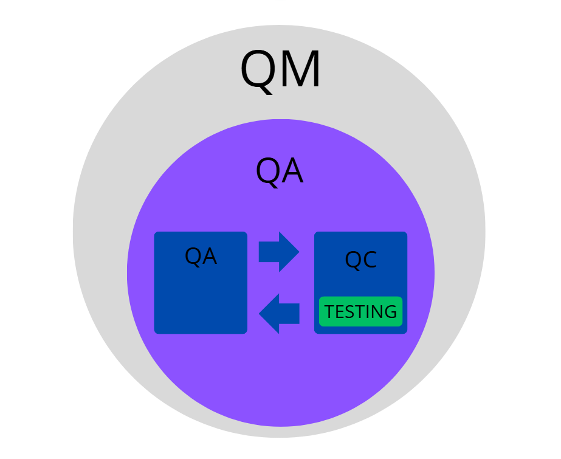

# QM, QA i QC 
**QM (Quality Management)** - system zarządzania jakością w organizacji obejmujący politykę jakości, cele jakościowe, procesy, nadzór oraz ciągłe doskonalenie, w celu zapewnienia zgodności produktów lub usług z wymaganiami klienta i normami. Obejmuje QA i QC.

**QA (Quality Assurance)** - działania związane z zapewnieniem jakości, poprzez tworzenie i nadzorowanie procesów, procedur oraz standardów mających zapobiegać powstawaniu błędów. 

**QC (Quality Control)** - działania związane z kontrolą i oceną jakości produktu, usługi, modułu lub systemu.

W ujęciu teoretycznym QC jest częścią QA, jednak w praktyce organizacyjnej QA i QC często funkcjonują jako niezależne obszary.

*Rys 1. Relacja między QM, QA, QC i testowaniem.*

# Czym jest testowanie?

**Testowanie** to proces oceny jakości oprogramowania i powiązanych artefaktów poprzez wykrywanie defektów oraz weryfikację, czy system spełnia określone wymagania.

# Cele testowania

- Budowanie zaufania do jakości produktu.
- Zapobieganie awariom, dzięki wczesnemu wykrywaniu niezgodności w procesie wytwarzania (obejmuje ocenę i weryfikację produktów pracy, takich jak wymagania, projekt i kod, a także sprawdzenie spełnienia zobowiązań wynikających z umów, standardów, prawa i oczekiwań interesariuszy).
- Sprawdzenie kompletności przedmiotu testów.

# Błąd, defekt i awaria

**Błąd (error)** - pomyłka człowieka prowadząca do powstania defektu w kodzie.

**Defekt (defect/bug)** - nieprawidłowość w kodzie lub działaniu programu.

**Awaria (failure)** - efekt działania defektu w czasie wykonania (zdarzenie, w którym moduł lub system nie wykonuje wymaganej funkcji w określonym zakresie).

# Zasady testowania

1.	Testowanie ujawnia obecność błędów, nie ich brak.
2.	Pełne testowanie jest niemożliwe.
3.	Wczesne testowanie oszczędza czas i koszty.
4.	Defekty koncentrują się w określonych obszarach systemu.
5.	Paradoks pestycydów - te same testy przestają wykrywać nowe błędy, trzeba je regularnie aktualizować.
6.	Testowanie zależy od kontekstu (np. testy systemów medycznych różnią się od testów gier).
7.	Brak błędów nie oznacza, że system jest użyteczny lub spełnia potrzeby użytkownika.

# Wybrane modele cyklu życia oprogramowania

**Sekwencyjne** - zakładają wykonanie poszczególnych czynności wytwórczych po kolei liniowo. Kolejna faza rozpoczyna się po zakończeniu poprzedniej.

- **Kaskadowy (waterfall)** - czynności testowe startują, gdy wszystkie inne czynności wytwórcze zostaną ukończone. Model ten jest stosowany, dla produktów posiadających dokładną dokumentacje i dobrze zdefiniowane wymagania (o niskim prawdopodobieństwie wystąpienia zmiany).

- **Model V** - w przeciwieństwie do kaskadowego wprowadza zasadę wczesnego testowania. Każdemu etapowi wytwarzania odpowiada powiązany etap testowania.

**Iteracyjno-przyrostowe** - oprogramowanie wytwarzane jest w krótkich cyklach, a funkcjonalności rosną przyrostowo.

- **SCRUM** - jedna z najpopularniejszych metodyk. Dzieli wytwarzanie oprogramowania na krótkie iteracje (sprinty) o tej samej długości. Częste zmiany. Dlatego testowanie staje się wyzwaniem, więc zamiast długotrwałego planowania stosuje się testowanie eksploracyjne, czy automatyzowanie dużych ilości testów, zwłaszcza testów regresji.

- **Kanban** - nie narzuca stałych iteracji czasowych. Proces wytwórczy organizowany jest w oparciu o wizualne karty zadań na tablicy oraz limity pracy w toku (WIP). Kolejne funkcjonalności przekazywane są do produkcji w miarę ich ukończenia, gdy pojawi się na nie zapotrzebowanie. Metoda ta kładzie nacisk na płynność przepływu, szybkie wykrywanie wąskich gardeł i elastyczne reagowanie na zmiany priorytetów.

- **Model spiralny Boehma** - nazywany jest modelem modeli, ponieważ można z niego uzyskać każdy model cyklu życia. Każda iteracja rozpoczyna się analizą ryzyka. Tworzy się w nim eksperymentalne elementy przyrostowe, które mogą być przebudowane, a nawet porzucone w dalszych etapach.

- **RUP** - iteracyjny model wytwarzania oparty na fazach i przypadkach użycia. Proces może być dostosowywany do potrzeb projektu, a rozwój systemu odbywa się iteracyjnie. 

# Poziomy testów

- **Testy jednostkowe/modułowe (Unit tests)** - testują małe fragmenty kodu, wykonywane głównie przez programistów.
- **Testy integracyjne** - sprawdzają współpracę między modułami lub systemami.
- **Testy systemowe** - obejmują testy całej aplikacji jako całości.
- **Testy akceptacyjne** - weryfikują zgodność z oczekiwaniami klienta lub użytkownika. Można je również podzielić ze względu na miejsce wykonywania:
    - **Alfa** - w siedzibie producenta, (środowisko testowe).
    - **Beta** - testowanie przez klienta (własne środowisko docelowe).

# Cykl życia defektu

Now → Assigned → Fixed → Retested → Closed (czasem: Reopened → Retested → Closed)

# Rodzaje testów

Ze względu, czy kod jest uruchamiany w trakcie testu:

- **Statyczne** - testowanie można wykonać bez konieczności uruchamiania testowanego obiektu (testowane specyfikacje, projekt architektury czy kod oprogramowania).
- **Dynamiczne** - testowanie może wymagać uruchomionego modułu lub systemu.

Ze względu na cel:

- **Funkcjonalne** - sprawdzenie, czy system działa zgodnie z wymaganiami (konkretne funkcjonalności).
- **Niefunkcjonalne** - badanie sposobu działania systemu (jakość, wydajność, bezpieczeństwo, użyteczność).

Ze względu na podejście:

- **Czarnoskrzynkowe (Black-box)** - tester nie zna kodu, testuje na podstawie specyfikacji i interfejsu użytkownika.
- **Białoskrzynkowe (White-box)** - tester zna strukturę kodu i testuje jego wewnętrzną logikę.
- **Bazujące na doświadczeniu** - nie bazują na dokumencie formalnym.

Ze względu na sposób wykonania:

- **Manualne** - tester wykonuje testy ręcznie, krok po kroku, bez użycia skryptów. Stosowane głównie dla testów eksploracyjnych, UX, walidacji funkcjonalności.
- **Automatyczne** - testy wykonywane są przez skrypty lub narzędzia (np. Selenium, Postman, Jenkins). Stosowane przy testach regresyjnych i powtarzalnych.

Testy związane ze zmianami:

- **Potwierdzające** - retesty stosuje się je zawsze po naprawie defektu. Sprawdzenie, czy defekt został rzeczywiście naprawiony.
- **Regresyjne** - upewniają się, że nowa zmiana nie zepsuła istniejących funkcji. Często się je automatyzuje.

Inne typy testów:

- **Smoke tests** - szybka weryfikacja, czy aplikacja działa po wdrożeniu. Sprawdzenie, czy główne funkcje działają (czy "się uruchamia").
- **Sanity tests** - sprawdzenie, czy konkretna poprawka działa zgodnie z oczekiwaniami.
- **Eksploracyjne** - tester spontanicznie bada aplikację bez gotowych przypadków testowych, szukając nieoczywistych błędów.
- **Pielęgnacyjne** - testy po wydaniu oprogramowania do użytku.

# Proces przeglądu produktów pracy

1.	Planowanie
2.	Rozpoczęcie przeglądu
3.	Przegląd indywidualny
4.	Przekazanie informacji o problemach i analiza problemów
5.	Usunięcie defektów i raportowanie

# Proces testowy (wg ISTQB)

1.	**Planowanie testów** -> plan testów (cel, podejście, techniki, harmonogram)
2.	**Monitorowanie testów** -> raporty z testów (oszacowanie jakości modułu na podstawie rezultatów, czy konieczne dalsze testy, sprawdzenie rezultatów)
3.	**Analiza testów** -> warunki testowe (analiza specyfikacji, diagramów, wymagań)
4.	**Projektowanie testów** -> przypadki testowe, zbiory testów
5.	**Implementacja testów** -> tworzenie zestawów testowych, przygotowanie danych testowych
6.	**Wykonywanie testów** -> dokumentacja (wykonanie testów), raport o defektach
7.	**Ukończenie testów** -> koniec

# Role w przeglądzie formalnym

1.	Autor
2.	Kierownictwo
3.	Facylitator (moderator) – rola mediatora
4.	Lider przeglądu
5.	Przeglądający
6.	Protokolant

# Weryfikacja a walidacja

- **Weryfikacja (Verification)** - czy system jest zbudowany zgodnie ze specyfikacją ("Czy robimy to dobrze?").
- **Walidacja (Validation)** - czy system spełnia potrzeby użytkownika ("Czy robimy to, czego oczekuje klient?").

# Przypadek testowy

- Nazwa testu
- Warunki wstępne
- Kroki do wykonania
- Dane wejściowe
- Oczekiwany rezultat
- Rzeczywisty rezultat
- Status (pass/fail)

# Raport z błędu (bug report)

- Identyfikator
- Tytuł
- Opis
- Data zgłoszenia
- Autor
- Priorytet
- Status zgłoszenia
- Identyfikacja elementu testowego
- Kroki do odtworzenia
- Rzeczywisty rezultat
- Oczekiwany rezultat
- Faza cyklu życia oprogramowania
- Załączniki (np. screeny, logi, video)

# Techniki projektowania przypadków testowych
- **Podział na klasy / zakresy równoważności** - np. pole "wiek" < 0 (błędne), 0 – 100 (poprawne), > 100 (błędne).
- **Analiza wartości brzegowych** - testowanie granicznych wartości danych.
- **Tablice decyzyjne** - sprawdzanie różnych kombinacji warunków i akcji.
- **Testy oparte na scenariuszach (Use case)** - testowanie pełnych ścieżek użytkownika.

# Specyfikacja wymagań
Specyfikacja to dokument w którym zawarto wszystkie oczekiwania funkcjonalne i niefunkcjonalne stawiane systemowi. SRS i BRS różnia się, ale są powiazane.

- SRS - specyfikacja wymagań oprogramowania 
- BRS - specyfikacja wymagań biznesowych 

Zawiera:

- Nazwa produktu
- Imiona i nazwiska jego autorów
- Wersja dokumentu
- Historia zmian
- Spis treści
- Charakterystyka firmy
- Opis przyszłego/aktualnego systemu
- Słownik pojęć
- Opis wymagań funkcjonalnych
- Opis wymagań niefunkcjonalnych
- Lista wymagań z priorytetyzacją i use-case
- Model systemu

# Dodatkowe pojęcia
- **Traceability Matrix (RTM)** - mapa powiązań między wymaganiami, a przypadkami testowymi.
- **Test Pyramid** - proporcje testów: najwięcej jednostkowych, mniej integracyjnych, najmniej UI.
- **Exit Criteria** - warunki zakończenia testów (np. 95% przypadków zakończonych sukcesem, brak krytycznych defektów, przekroczenie budżetu).

---
# Co jeszcze tu dodać?
- Analiza wartości brzegowych itd. W którym poziomie testów
- ATTD ITD. Przypomnieć!
- Rodzaje przglądu !!!!
- Kwadrat testowy
- Jakie narzędzia w jakiej  czynności testowej
- Śledzenie powiązań!!!
